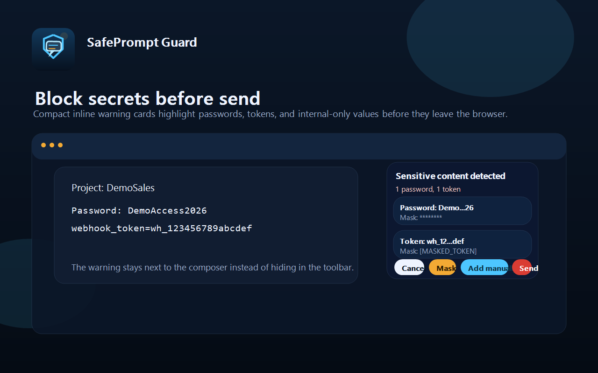
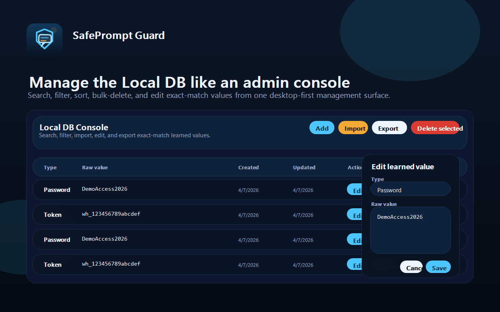
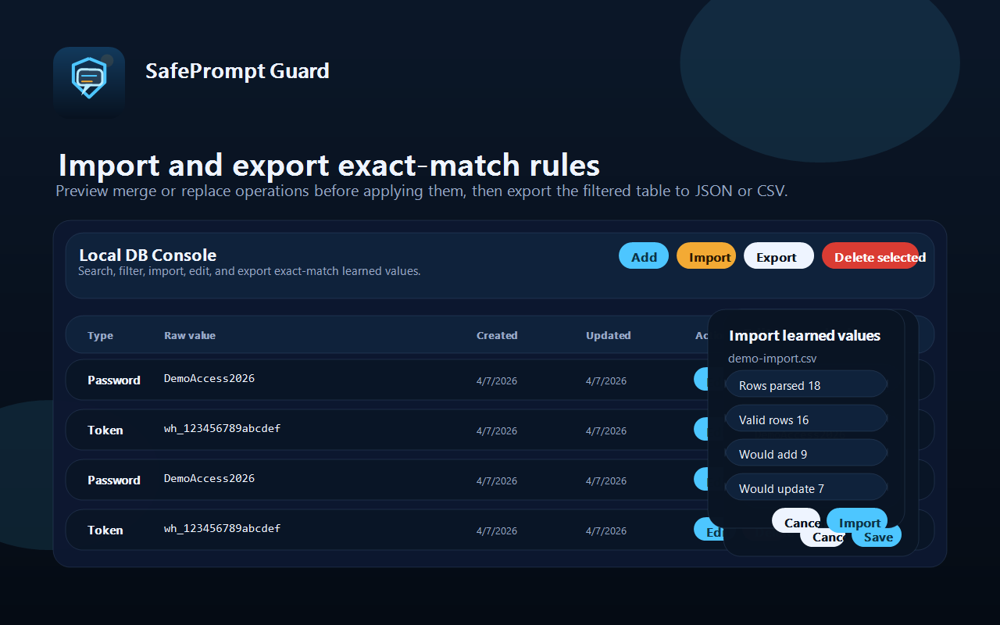
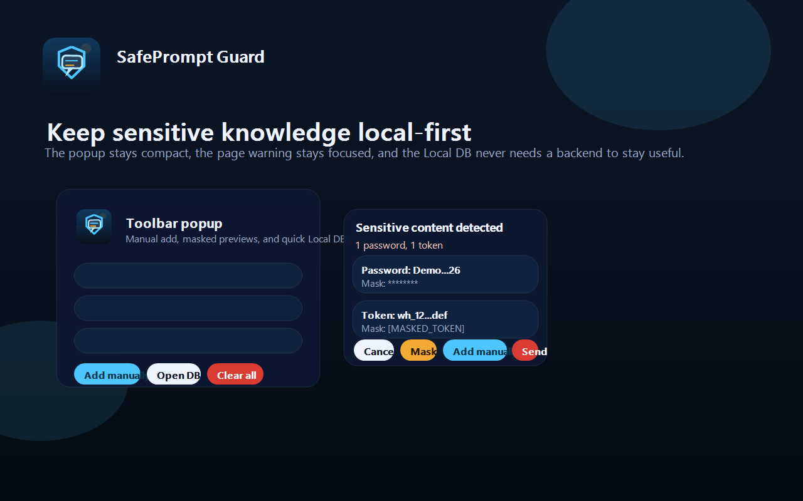

# SafePrompt Guard

<p align="center">
  
</p>

<p align="center">
  <a href="https://chromewebstore.google.com/detail/safeprompt-guard/lonecdoaidnlogmkfmpkpejjacaklbbc">
    
  </a>
  
  
  
  
</p>

<p align="center">
  <strong>Detect sensitive content before it is sent to AI tools.</strong><br />
  Local-first. No account. No external upload.
</p>

<p align="center">
  
</p>

---

## Install

### Chrome Web Store (recommended)

[**Install SafePrompt Guard →**](https://chromewebstore.google.com/detail/safeprompt-guard/lonecdoaidnlogmkfmpkpejjacaklbbc)

### Manual (developer mode)

1. Open Chrome → `chrome://extensions`
2. Enable **Developer mode**
3. Click **Load unpacked**
4. Select the `apps/SafePrompt-Guard` folder

---

## What It Does

SafePrompt Guard scans prompt text locally on supported AI tools and flags:

- **Passwords and labeled credentials** — `password:`, `pass=`, `secret:`, and common credentials
- **Tokens and keys** — API keys, JWTs, private keys, webhook tokens, connection strings
- **Internal references** — private IPs, internal hostnames, organization-specific values
- **Common and default passwords** — curated offline list checked without any network call

When risky content is detected, a compact inline warning appears near the send button. You can review each finding, mask it, or add it to the Local DB for future detection — all without leaving the writing flow.

---

## Supported Sites

| Site | Status |
|------|--------|
| `chatgpt.com` / `chat.openai.com` | ✅ Supported |
| `claude.ai` | ✅ Supported |
| `gemini.google.com` | ✅ Supported |
| `perplexity.ai` | ✅ Supported |

---

## How It Works

**01 · Scan before send** — Prompt text is analyzed locally every time you are about to send. No text leaves your browser to be scanned.

**02 · Review findings** — A compact inline warning near the send area summarizes what was found with severity (HIGH / MEDIUM / LOW). Each finding shows a masked preview and a per-finding Mask button.

**03 · Mask or learn** — Mask a specific value immediately (replaces it with `********` or `[MASKED_TOKEN]`), or add it to the Local DB so future prompts are checked against it automatically.

---

## Local DB

Open the extension popup → **Open DB**.

The Local DB console supports:

- Add, edit, delete, bulk delete
- Search and type filter
- Sort by newest, oldest, or type
- Export filtered rows to **JSON** or **CSV**
- Import JSON or CSV with **Merge** or **Replace all**

All values stay local. They are stored in `chrome.storage.local` and are never uploaded.

---

## Screenshots

| Warning popup | Local DB console |
|---|---|
|  |  |

| Import / Export | Toolbar popup |
|---|---|
|  |  |

---

## org_rules.json

`org_rules.json` provides organization-aware context. Fill in these fields with your team's values:

| Field | Purpose |
|-------|---------|
| `customerNames` | Customer names that should not appear in prompts |
| `projectNames` | Internal project names |
| `internalCodeNames` | Code names for unreleased products |
| `productNames` | Product names that are not public |
| `internalOnlyPhrases` | Exact phrases that are internal-only |
| `allowlistedTerms` | Values that should never be flagged |
| `riskyContextWords` | Words that raise severity when combined with org names |

Names alone stay LOW or are skipped. Names combined with actual credentials become HIGH.

---

## Privacy

- No backend, no account system, no external detection APIs
- No data is sent outside the browser
- The Local DB is stored only in `chrome.storage.local`
- [Full Privacy Policy](https://stiliyan-dev.github.io/safeprompt-guard/privacy-policy.html)

---

## Known Limitations

- Send button discovery is heuristic-based and can miss site DOM changes
- Attachment files (PDFs, images) are not scanned
- Learned matching is exact and case-sensitive by design
- The embedded static password pack is intentionally curated, not a full breach corpus

---

## Developer Notes

<details>
<summary>Debug mode</summary>

Debug mode is off by default. To enable in the browser console:

```js
chrome.storage.local.set({ debug: true });
```

When on, the content script and service worker log: initialization, editor discovery, detector results, warning rendering, and all user actions.

</details>

<details>
<summary>Run regression tests</summary>

```powershell
powershell -ExecutionPolicy Bypass -File apps\SafePrompt-Guard\run-detector-tests.ps1
powershell -ExecutionPolicy Bypass -File apps\SafePrompt-Guard\post-change-smoke.ps1
```

Additional manual coverage: `TEST_CASES.md`, `MANUAL_TEST_PLAN.md`

</details>

<details>
<summary>Quick manual test prompt</summary>

Paste into a supported AI composer to trigger a detection:

```
Project: DemoSales
Customer: Demo Corporation
Password: admin
webhook_token=wh_123456789abcdef
```

</details>

---

## Links

- [Chrome Web Store listing](https://chromewebstore.google.com/detail/safeprompt-guard/lonecdoaidnlogmkfmpkpejjacaklbbc)
- [Homepage](https://stiliyan-dev.github.io/safeprompt-guard/)
- [Privacy Policy](https://stiliyan-dev.github.io/safeprompt-guard/privacy-policy.html)
- [Support / Issues](https://github.com/stiliyan-dev/safeprompt-guard/issues)


